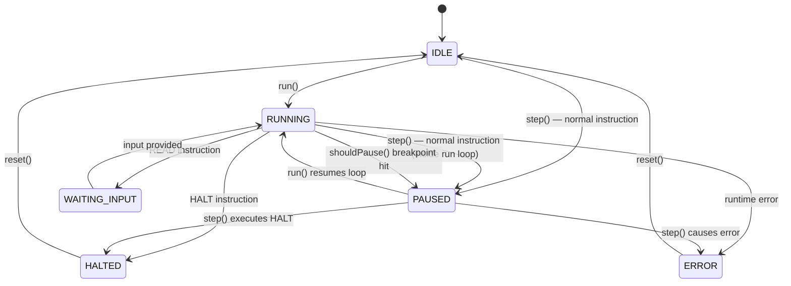
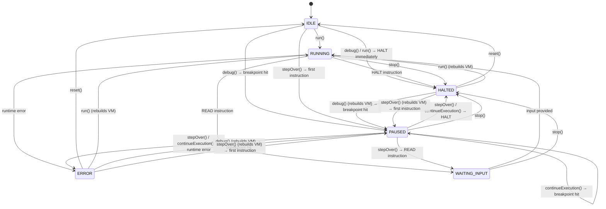

# AsciiAsm — Project Documentation for Agents

> **Single source of truth** for AI coding agents and developers working on the AsciiAsm Web IDE project.

**Version:** 0.1.0  

---

# Part 1 — Project Overview

## 1.1 What is AsciiAsm?

AsciiAsm (Education Assembler) is a browser-based IDE for an educational assembly language. It includes:

- A **code editor** with syntax highlighting, autocomplete, linting, and breakpoint support (CodeMirror 6)
- A **virtual machine** (VM) that executes AsciiAsm programs step-by-step
- A **debugger** with breakpoints, single-stepping, and state inspection
- **Registers**, **flags**, and **memory** panels for real-time visualization

## 1.2 Tech Stack

| Technology | Purpose |
|------------|---------|
| **TypeScript** | All source code |
| **Vue 3** (Composition API) | UI framework (single `App.vue` + `HelpModal.vue`) |
| **Vite** | Build tool and dev server |
| **Vitest** | Unit testing framework |
| **CodeMirror 6** | Code editor (syntax, linting, autocomplete, gutters) |
| **CSS** (plain) | Styling — no CSS framework |

## 1.3 Project Structure

```
/
├── AGENTS.md                         # This file — project documentation AND single source of truth
├── package.json                      # npm config (name: asciiasm-ide)
├── tsconfig.json                     # TypeScript config with path aliases
├── vite.config.ts                    # Vite build config
├── vitest.config.ts                  # Vitest test config
├── index.html                        # Entry HTML
│
├── examples/                         # Example .asciiasm programs
│   ├── hello-world.asciiasm
│   ├── counter.asciiasm
│   ├── sum-two-numbers.asciiasm
│   ├── max-two-numbers.asciiasm
│   └── char-arithmetic.asciiasm
│
├── src/
│   ├── main.ts                       # Vue app entry point
│   ├── App.vue                       # Main UI component (toolbar, editor, panels)
│   ├── HelpModal.vue                 # Language spec help modal
│   ├── style.css                     # Global styles
│   ├── env.d.ts                      # TypeScript env declarations
│   │
│   ├── core/                         # VM and language core (zero UI dependencies)
│   │   ├── types.ts                  # Enums, interfaces: Token, VMState, Program, etc.
│   │   ├── errors.ts                 # Error classes: AsciiAsmError, ParseError, RuntimeError
│   │   ├── lexer.ts                  # Tokenizer: source text → Token[]
│   │   ├── parser.ts                 # Parser: Token[] → Program AST
│   │   ├── memory.ts                 # Memory model: linear ASCII cell array
│   │   ├── registers.ts             # Register file: AX, BX, CX, DX, SI, DI, BP, SP + FLAGS
│   │   ├── vm.ts                     # Virtual Machine: instruction execution
│   │   └── debugger.ts              # Debugger: breakpoints, step/continue/stop/reset
│   │
│   ├── editor/                       # CodeMirror 6 extensions
│   │   ├── asciiasm-language.ts        # Stream parser for syntax highlighting
│   │   ├── asciiasm-linter.ts          # Linter (runs Lexer+Parser, reports diagnostics)
│   │   ├── asciiasm-autocomplete.ts    # Autocompletion provider
│   │   └── editor-setup.ts          # Editor factory, breakpoint gutter, debug line
│   │
│   ├── composables/                  # Vue composables (reactive state)
│   │   ├── useAppStore.ts            # Main store: VM lifecycle, actions, state sync
│   │   ├── useFileStore.ts           # File management (localStorage persistence)
│   │   ├── useLanguage.ts            # Language preference for help modal specs
│   │   └── useTheme.ts              # Dark/light theme toggle
│   │
│   └── utils/                        # Utilities
│       ├── event-bus.ts              # Typed event emitter
│       ├── formatter.ts             # Value formatting helpers
│       └── hotkeys.ts               # Hotkey definitions and matchers
│
├── docs/                             # ⚡ GENERATED (en) + MAINTAINED (other langs)
│   ├── en/
│   │   └── language-specification.md # Extracted from AGENTS.md Part 2 at build time
│   └── uk/
│       └── language-specification.md # Ukrainian translation (manually maintained)
│
└── tests/
    └── core/                         # Unit tests for core modules
        ├── lexer.test.ts
        ├── parser.test.ts
        ├── memory.test.ts
        ├── registers.test.ts
        └── vm.test.ts
```

> **Note:** `docs/en/language-specification.md` is auto-generated by the `extract-spec` Vite plugin
> (see `vite.config.ts`) from **Part 2** of this file. Never edit it manually — edit Part 2 here instead.
> The `docs/` layout supports future translations, e.g. `docs/ru/language-specification.md`.

## 1.4 Path Aliases (tsconfig)

| Alias | Maps to |
|-------|---------|
| `@core/*` | `src/core/*` |
| `@editor/*` | `src/editor/*` |
| `@ui/*` | `src/ui/*` |
| `@utils/*` | `src/utils/*` |

## 1.5 Key Architecture Decisions

- **`src/core/` has zero UI dependencies** — it depends only on TypeScript types and standard APIs. The VM, Debugger, Lexer, Parser, Memory, and Registers are pure logic and fully testable without a DOM.
- **Single composable store** (`useAppStore`) — owns the VM/Debugger lifecycle, reactive state, and all user actions. The Vue UI layer calls store methods; it never touches core objects directly.
- **CodeMirror state is independent** — breakpoint markers and debug line highlights are managed via CodeMirror `StateField`/`StateEffect`, synced to the store via callbacks.
- **localStorage keys** — `asciiasm-theme`, `asciiasm-files`, `asciiasm-current-file-id`, `asciiasm-files-visible`, `asciiasm-console-height`.

## 1.6 Commands

| Command | Purpose |
|---------|---------|
| `npm run dev` | Start Vite dev server |
| `npm run build` | TypeScript check + production build |
| `npm run test` | Run all Vitest tests |
| `npm run test:watch` | Run tests in watch mode |
| `npm run test:coverage` | Run tests with coverage report |

---

# Part 2 — AsciiAsm Language Specification

## 2.1 Memory

### 2.1.1 Directive #memory

```
#memory memory_size[, 'init_char_value']
```

Specifies the number of memory cells (integer > 0) and an ASCII value for initializing all memory (optional).
If absent — default size: **100** and memory is uninitialized.
Must be the first line of the program if present.
Accessing memory beyond its bounds causes the program to terminate with an error.

### 2.1.2 Directive #on_overflow

This pragma allows switching the processor's behavior when an arithmetic overflow occurs.

`#on_overflow flag` (default mode):
On overflow, only the OF flag is set in the FLAGS register. The program continues executing the next instruction. This allows the programmer to decide what to do (e.g., use `JO label`).

`#on_overflow halt`
On any operation that causes OF = 1 (including MOV, READ), the interpreter immediately halts execution with an error `Runtime Error: Type Overflow`. This is useful for beginners so they can immediately see logic errors.

### 2.1.3 Memory Model

Memory is a linear array of ASCII cells, indexed from 0.
Each cell stores one character (ASCII code 32–126 — printable characters only).
The minimum addressable unit is one cell.

> **Warning:** memory is **not initialized** by default — cells contain random ASCII characters.
> The program must write values before first read, or use `#data` for explicit initialization.

### 2.1.4 Data Types

AsciiAsm has five types. All numeric types are signed.

| Type | Cells | Format in memory | Range |
|------|-------|-------------------|-------|
| `CHAR` | 1 | raw ASCII character | codes 32–126 (printable) |
| `WORD` | 2 | [sign] + 1-2 digits | -9..99 |
| `DWORD` | 4 | [sign] + 3-4 digits | -999..9999 |
| `QWORD` | 8 | [sign] + 7-8 digits | -9999999..99999999 |
| `TEXT` | variable | ASCII characters until terminator `$` | — |

#### Number Format in Memory (WORD / DWORD / QWORD)

First cell — sign `'-'` for negatives; for positives — the most significant digit or a leading zero.
Remaining cells — digits with leading zeros padded to full width.

Examples as ASCII strings:

```
WORD   -4  →  "-4"
WORD    4  →  "04"
WORD    0  →  "00"

DWORD  -42   →  "-042"
DWORD   42   →  "0042"
DWORD  -999  →  "-999"   # minimum value for DWORD type
DWORD    0   →  "0000"
DWORD   999  →  "0999"
DWORD  9999  →  "9999"   # maximum value for DWORD type

QWORD  -12345  →  "-0012345"
QWORD   12345  →  "00012345"
```

#### CHAR Format in Memory

One cell, stores the character directly as an ASCII character.
Arithmetic on CHAR shifts the character's position in the ASCII table.

```
CHAR 'A'  →  "A"    (ASCII 65)
CHAR 'z'  →  "z"    (ASCII 122)
CHAR ' '  →  " "    (ASCII 32)
```

Valid values: ASCII 32–126 (printable characters only).
Going out of range during operations — type overflow with clamping to the nearest valid value.

#### TEXT Format in Memory

A sequence of ASCII characters terminated by the `$` terminator character.
Size is not fixed — determined by the position of `$`.

```
"Hello"  →  "Hello$"   (6 cells)
""       →  "$"         (1 cell)
```

### 2.1.5 Directive #data — Memory Initialization

`#data` directives are placed after `#memory` and before the first instruction.
They write values at the specified absolute address.

```
#data address, TYPE value[, #RRGGBB]
```

The optional third parameter `#RRGGBB` is a CSS hex color literal (six lowercase or uppercase hex digits
preceded by `#`). When present, all memory cells written by this directive are highlighted with that
background color in the IDE's **Memory** visualization panel, which helps users visually distinguish
different data segments at a glance.

Syntax for each type:

```
#data 0,  WORD -4
#data 2,  DWORD 42,       #4488ff   ; integer — blue tint
#data 6,  QWORD 9999999
#data 14, CHAR 'A',        #ffaa00   ; character — amber tint
#data 15, TEXT "Hello$",   #44bb77   ; text segment — green tint
```

Rules:
- Address — a non-negative decimal integer. The address must not exceed the memory bounds, otherwise a runtime error occurs.
- Directives are executed sequentially; a later one overwrites an earlier one.
- Address + size must not exceed `#memory`.
- For `TEXT`: the `$` character is mandatory in the literal.
- For `CHAR`: literal in single quotes (`'A'`).
- Color — exactly six hexadecimal digits preceded by `#` (e.g. `#ff0000`). Case-insensitive.
  - If multiple directives cover the same memory cell, the last directive's color wins.
  - The color has no effect at runtime; it is a visualization aid only.

---

## 2.2 Architectural AsciiAsm Language Overview

### 2.2.1 General-Purpose Registers

| Register | Conventional Purpose |
|----------|----------------------|
| `AX` | Accumulator, results |
| `BX` | Addresses, pointers |
| `CX` | Counters, loops |
| `DX` | Auxiliary operand |
| `SI` | Source index, source pointers |
| `DI` | Destination index, destination pointers |
| `BP` | Base pointer, frame-relative addressing |
| `SP` | Stack pointer, top-of-stack tracking |

> Conventional purpose is only a convention. Any register can be used for any purpose.
> On VM initialization and every `reset()`, `SP` is preloaded with the configured `#memory` size.
> `SP` is also used by `CALL`/`RET` as a downward-growing call stack pointer. Saved return addresses always use the `DWORD` memory format, so every instruction address in AsciiAsm occupies 4 cells when stored on the stack.

Each register has a **dynamic type** — **CHAR** or **integer** — determined
by the last write operation:

- `MOV reg, imm` or `MOV reg, WORD/DWORD/QWORD [addr]` → register type becomes **integer**.
- `MOV reg, label` → register type becomes **integer** and stores the instruction pointer of the first instruction after that label.
- `MOV reg, CHAR 'c'` or `MOV reg, CHAR [addr]` → register type becomes **CHAR**.
- `MOV reg, reg2` → copies both value and type.

Mixing CHAR and integer types is forbidden in all operations, **except** `ADD`/`SUB`
(CHAR ± integer = CHAR). Attempting to perform a forbidden cross-type operation
results in a runtime error: `Runtime Error: Type Mismatch`.

### 2.2.2 Service Registers

| Register | Purpose |
|----------|---------|
| `IP` | Instruction Pointer — index of the current instruction in the parsed program. This is the VM's internal instruction pointer, **not** the source-code line number. `IP` is readable from program code as an integer register value, but it is read-only; any attempt to write to `IP` causes `Runtime Error`. |
| `SLP` | Source Line Pointer — index of the current instruction in source code (line) |
| `FLAGS` | Status flags: ZF, SF, OF |

### 2.2.3 Flags (FLAGS)

| Flag | Name | Set when... |
|------|------|-------------|
| `ZF` | Zero Flag | Operation result = 0 |
| `SF` | Sign Flag | Mathematical result is negative (not truncated after overflow) |
| `OF` | Overflow Flag | Result exceeds the type's range |

Flags are updated by: `READ`, `MOV`, `ADD`, `SUB`, `CMP`. All other instructions do not modify flags.

---

## 2.3 Syntax

### 2.3.1 General Rules

- Comment — from `;` to end of line.
- Mnemonics, registers, types — case-insensitive.
- Label identifiers: `[a-zA-Z_][a-zA-Z0-9_]*`
- Numeric literals: decimal with or without sign (`42`, `-7`).
- Character literals: single quotes (`'A'`, `' '`).

### 2.3.2 Program Structure

```
[#memory N]
[#data address, TYPE value[, #RRGGBB]]
...

_start:
    instructions
    HALT

[other labels and instructions]
```

The `_start:` label is mandatory. Labels in code: `identifier:` at the beginning of a line.
When used as an operand, a label resolves to the instruction pointer of the first instruction after that label.
Labels can be used directly in branch instructions (`JMP`, `JE`, ...) and can also be loaded into an integer register via `MOV reg, label`.

### 2.3.3 Addressing

| Form | Meaning |
|------|---------|
| `reg` | register value (type is dynamic) |
| `imm` | numeric constant (type — integer) |
| `label` | instruction pointer of the first instruction after the label (type — integer) |
| `CHAR 'c'` | character constant (type — CHAR) |
| `TYPE [imm]` | access to memory of type "TYPE" at the numeric constant address imm |
| `TYPE [reg]` | access to memory of type "TYPE" at the address retrieved from the register reg |
| `TYPE [reg + imm]` | access to memory of type "TYPE" at the address `register_value + displacement` |

`TYPE` is mandatory for every memory access through `[...]`.
`CHAR 'c'` can be used as an operand in `MOV reg, CHAR 'c'`, `CMP reg, CHAR 'c'` and `MOV CHAR [addr], 'c'`.
For memory operands, `addr` may be `[imm]`, `[reg]`, or `[reg + imm]`. The displacement is a signed decimal integer.

---

## 2.4 Instruction Set

### 2.4.1 MOV — Data Movement (copying data)

```nasm
MOV dst, src                ; general command format
MOV reg, imm                ; reg ← number (register type → integer)
MOV reg, label              ; reg ← instruction pointer of label (register type → integer)
MOV reg, CHAR 'c'           ; reg ← character (register type → CHAR)
MOV reg, reg2               ; reg ← reg2 (value and type are copied)
MOV reg, TYPE [addr]        ; reg ← value from memory (register type → according to TYPE)
MOV reg, TYPE [reg + imm]   ; reg ← value from memory via Base+Displacement addressing
MOV TYPE [addr], reg        ; memory ← reg (register type must match TYPE)
MOV TYPE [addr], imm        ; memory ← constant (TYPE: WORD/DWORD/QWORD, not CHAR)
MOV CHAR [addr], 'c'        ; memory CHAR ← character literal
```

`[addr]` — `[imm]`, `[reg]`, or `[reg + imm]`.

**Type rules:**
- `MOV reg, label` — reg receives an integer instruction pointer for the first instruction after the label.
- `MOV IP, ...` — **forbidden** because `IP` is read-only (`Runtime Error`).
- `MOV WORD/DWORD/QWORD [addr], reg` — reg **must** contain an integer, otherwise `Runtime Error: Type Mismatch`.
- `MOV CHAR [addr], reg` — reg **must** contain CHAR, otherwise `Runtime Error: Type Mismatch`.
- `MOV CHAR [addr], imm` — **forbidden** (`Runtime Error: Type Mismatch`). Use `MOV CHAR [addr], 'c'`.

MOV updates flags if data does not fit in dst and digits were truncated.

### 2.4.2 Arithmetic

The result is stored in the first operand. Flags `ZF`, `SF`, `OF` are updated.
On overflow, `SF` is based on the mathematical result, not the truncated one.

```nasm
ADD dst, src
SUB dst, src
```

Allowed combinations:

| `dst` | `src` | Note |
|-------|-------|------|
| `reg(integer)` | `reg(integer)` | integer ± integer = integer |
| `reg(integer)` | `imm` | integer ± integer = integer |
| `reg(CHAR)` | `imm` | CHAR ± integer = CHAR (ASCII position shift) |
| `reg(CHAR)` | `reg(integer)` | CHAR ± integer = CHAR (ASCII position shift) |
| `reg` | `TYPE [addr]` | TYPE: WORD/DWORD/QWORD; reg must be an integer |
| `TYPE [addr]` | `reg(integer)` | read → compute → write back; TYPE: WORD/DWORD/QWORD/CHAR |
| `TYPE [addr]` | `imm` | read → compute → write back; TYPE: WORD/DWORD/QWORD/CHAR |

**Forbidden combinations** (runtime error `Runtime Error: Type Mismatch`):
- CHAR + CHAR, CHAR − CHAR (any combination where both operands are CHAR)
- integer + CHAR, integer − CHAR (src is CHAR)
- `reg(CHAR)` + `TYPE [addr]` (CHAR register with numeric memory)

**CHAR arithmetic** — the only allowed cross-type: CHAR ± integer.
This allows shifting a character along the ASCII table (e.g., changing letter case).
Result outside 32–126 — overflow (OF=1), result is clamped to the nearest range boundary (32 or 126).

For WORD/DWORD/QWORD: overflow → OF=1, result is written as-is using the least significant digits.

TEXT does not support arithmetic.

### 2.4.3 CMP — Comparison

Computes `first − second`, updates `ZF`, `SF`, `OF`. Does not store the value.
On overflow, `SF` is based on the mathematical result, not the truncated one.

Comparison is allowed only within the same type: CHAR with CHAR, integer with integer.
Attempting to compare CHAR with integer → `Runtime Error: Type Mismatch`.

```nasm
CMP reg,          reg2          ; both registers must match by type (CHAR↔CHAR or integer↔integer)
CMP reg,          imm           ; reg must be an integer
CMP reg,          CHAR 'c'      ; reg must be CHAR
CMP reg,          TYPE [addr]   ; reg type must match TYPE (CHAR↔CHAR or integer↔integer)
CMP TYPE [addr],  reg           ; reg type must match TYPE
CMP TYPE [addr],  imm           ; TYPE: WORD/DWORD/QWORD (not CHAR)
CMP CHAR [addr],  'c'           ; CHAR ↔ CHAR
```

TYPE: WORD / DWORD / QWORD / CHAR. TEXT is not supported.

### 2.4.4 Branches

All numeric types are signed — only signed branch conditions.
A jump target may be either:

- a label, resolved to the instruction pointer of the first instruction after that label
- an integer register containing a valid instruction pointer

Using a CHAR register as a jump target causes `Runtime Error: Type Mismatch`.
Using an integer value that does not point to a valid instruction causes a runtime error.

```nasm
JMP target   ; unconditional
CALL target  ; push return instruction address as DWORD via SP, then jump
RET          ; pop DWORD return instruction address from [SP] and jump back
JO  target   ; OF = 1  jump if overflow occurred
JNO target   ; OF = 0  jump if no overflow
JE  target   ; ZF=1          equal (==)
JNE target   ; ZF=0          not equal (!=)
JL  target   ; SF=1, ZF=0    less than (<)
JLE target   ; SF=1 or ZF=1  less than or equal (<=)
JG  target   ; SF=0, ZF=0    greater than (>)
JGE target   ; SF=0 or ZF=1  greater than or equal (>=)
```

Example:

```nasm
  MOV AX, fn_sum    ; AX ← instruction pointer of the first instruction under fn_sum
  JMP AX            ; jump indirectly through AX

fn_sum:
  ; some code
```

`CALL`/`RET` use the normal VM memory as a call stack:

- The stack grows toward lower memory addresses.
- `CALL target` decrements `SP` by 4, stores the next instruction pointer at `DWORD [SP]`, then jumps to `target`.
- `RET` reads the saved return instruction pointer from `DWORD [SP]`, increments `SP` by 4, then jumps to the restored instruction.
- Stored return addresses always use `DWORD`, because AsciiAsm instruction addresses have `DWORD` size when written to memory.
- `CALL` requires 4 writable memory cells below the current `SP`; otherwise a runtime memory error occurs.
- `RET` requires a valid saved `DWORD` return address at the current `SP`; invalid stack memory access or an invalid restored instruction pointer causes a runtime error.
- `CALL` and `RET` do not modify FLAGS.

### 2.4.5 READ and WRITE — Input and Output

Full syntax (memory operand):

```nasm
READ    TYPE [addr]         ; read from stdin → memory
WRITE   TYPE [addr]         ; output from memory → stdout
WRITELN [TYPE [addr]]       ; output from memory → stdout and output a newline character at the end.
```

WRITELN — can be used without parameters, in which case it simply outputs a newline character.

**Shorthand WRITE/WRITELN forms (registers and constants):**

```nasm
WRITE   reg                 ; output register value (integer as number, CHAR as character)
WRITE   imm                 ; output integer constant
WRITE   'c'                 ; output character literal
WRITE   "text"              ; output string literal directly (trailing '$' stripped if present)

WRITELN reg
WRITELN imm
WRITELN 'c'
WRITELN "text"
```

Examples:

```nasm
MOV  AX, 42
WRITE AX          ; outputs: 42

MOV  BX, CHAR 'Z'
WRITE BX          ; outputs: Z

WRITE 10          ; outputs: 10
WRITE 'C'         ; outputs: C
WRITE "Hello"     ; outputs: Hello
WRITELN "Done"    ; outputs: Done followed by newline
```

Behavior by type (memory operand):

| Type | READ | WRITE |
|------|------|-------|
| `WORD` | read number → store in WORD format | output number without leading zeros and '+' |
| `DWORD` | read number → store in DWORD format | output number without leading zeros and '+' |
| `QWORD` | read number → store in QWORD format | output number without leading zeros and '+' |
| `CHAR` | read one character → store as CHAR | output one character directly |
| `TEXT` | read string → store + `$` | output characters until `$` (exclusive), no length validation except out-of-bounds #memory check |

Additional parameters:
```nasm
READ TYPE  [addr],        "prompt"      ; display prompt before asking for input
READ TEXT  [addr],        "prompt"      ; TEXT input with prompt, no length limit
READ TEXT  [addr], imm                  ; read a string, max (imm - 1) characters, append `$` at the end
READ TEXT  [addr], imm,  "prompt"      ; TEXT input with max length and prompt
```

The optional `"prompt"` string literal is passed to the host environment and displayed to the user before input is requested (e.g. shown in a browser prompt dialog). It can be appended to any READ form as the last parameter.

Truncation on `READ` when a number does not fit in the type: preserve the sign, keep the least significant digits that fit in the given type. On truncation, the overflow flag OF is set.

### 2.4.6 HALT

`HALT` — stops program execution and must be explicitly specified to terminate the program.

---

## 2.5 Example Programs

### Sum of Two Numbers

```nasm
#memory 16
#data 0, DWORD 0
#data 4, DWORD 0

_start:
  READ  DWORD [0], "Enter first number:"
  READ  DWORD [4], "Enter second number:"
  MOV   AX, DWORD [0]
  ADD   AX, DWORD [4]
  MOV   DWORD [0], AX
  WRITE "Sum: "
  WRITELN DWORD [0]
  HALT
```

### Maximum of Two Numbers

```nasm
#memory 16
#data 0, DWORD 0
#data 4, DWORD 0

_start:
  READ DWORD [0], "Enter first number:"
  READ DWORD [4], "Enter second number:"
  MOV  AX, DWORD [0]
  CMP  AX, DWORD [4]
  JGE  show_first
  WRITE "Maximum: "
  WRITELN DWORD [4]
  JMP  done
show_first:
  WRITE "Maximum: "
  WRITELN DWORD [0]
done:
  HALT
```

### Loop: Sum from 1 to N

```nasm
#memory 32
#data 0, DWORD 0    ; n
#data 4, DWORD 0    ; i
#data 8, QWORD 0    ; total

_start:
  READ  DWORD [0], "Enter upper limit (N):"
  MOV   DWORD [4], 1     ; i = 1
loop:
  MOV   AX, DWORD [4]
  CMP   AX, DWORD [0]
  JG    done
  ADD   QWORD [8], AX    ; total += i
  ADD   DWORD [4], 1     ; i++
  JMP   loop
done:
  WRITE "Sum from 1 to N: "
  WRITELN QWORD [8]
  HALT
```

### String Output

```nasm
#memory 32
#data 0, TEXT "Hello, World!$"

_start:
  WRITELN TEXT [0]
  HALT
```

### Subroutine Call by Label

```nasm
#memory 32

_start:
  CALL greet
  WRITELN "Back in main"
  HALT

greet:
  WRITELN "Hello from subroutine"
  RET
```

### Indirect Subroutine Call Through Register

```nasm
#memory 32

_start:
  MOV AX, print_msg
  CALL AX
  HALT

print_msg:
  WRITELN "Indirect call works"
  RET
```

### Multiply via Subroutine (`fn_mul`)

```nasm
#memory 32
#data 0, DWORD 6
#data 4, DWORD 7

_start:
  MOV AX, DWORD [0]      ; arg1 = left operand
  MOV BX, DWORD [4]      ; arg2 = right operand
  CALL fn_mul
  WRITE "Product: "
  WRITELN CX             ; return value = AX * BX
  HALT

fn_mul:
  ; AX = first argument
  ; BX = second argument
  ; CX = return value
  MOV CX, 0

mul_loop:
  CMP BX, 0
  JE  mul_done
  ADD CX, AX
  SUB BX, 1
  JMP mul_loop

mul_done:
  RET
```

### Working with CHAR

```nasm
#memory 8
#data 0, CHAR 'A'

_start:

  WRITE "Source char is: "
  WRITELN CHAR [0]         ; outputs: A
  ADD   CHAR [0], 1      ; 'A' + 1 = 'B'
  WRITE "Next Char after 'A' is: "
  WRITELN CHAR [0]       ; outputs: B + newline
  HALT
```

### Base + Displacement Addressing

```nasm
#memory 24
#data 8, DWORD 10
#data 12, DWORD 20

_start:
  MOV BX, 8
  MOV AX, DWORD [BX + 4]   ; reads DWORD [12]
  WRITELN AX               ; outputs: 20
  HALT
```

---

## 2.6 Instruction Summary Table

| Instruction | Description | FLAGS |
|-------------|-------------|:-----:|
| `MOV dst, src` | Move (types must match; `MOV reg, label` stores an instruction pointer) | Yes |
| `ADD dst, src` | Addition (CHAR±integer allowed) | Yes |
| `SUB dst, src` | Subtraction (CHAR±integer allowed) | Yes |
| `CMP a, b` | Comparison (types must match) | Yes |
| `JMP target` | Unconditional jump to label or integer register target | No |
| `CALL target` | Push next instruction address as `DWORD` at `DWORD [SP-4]`, update `SP`, jump to label or integer register target | No |
| `RET` | Pop `DWORD` return address from `DWORD [SP]`, restore `SP`, jump back | No |
| `JE / JNE target` | Equal / not equal; target is label or integer register | No |
| `JL / JLE target` | Less than / less than or equal; target is label or integer register | No |
| `JG / JGE target` | Greater than / greater than or equal; target is label or integer register | No |
| `JO / JNO target` | Overflow / no overflow; target is label or integer register | No |
| `READ TYPE [addr]` | Read from stdin into memory | Yes |
| `READ TYPE [addr], "msg"` | Read from stdin with prompt message | Yes |
| `READ TEXT [addr], n` | Read string (max n-1 characters) | Yes |
| `READ TEXT [addr], n, "msg"` | Read string with max length and prompt | Yes |
| `WRITE TYPE [addr]` | Output from memory to stdout | No |
| `WRITE reg` | Output register value to stdout | No |
| `WRITE imm` | Output integer constant to stdout | No |
| `WRITE 'c'` | Output character literal to stdout | No |
| `WRITE "text"` | Output string literal to stdout | No |
| `WRITELN TYPE [addr]` | Output from memory to stdout + "\n" | No |
| `WRITELN reg/imm/'c'/"text"` | Output value to stdout + "\n" | No |
| `WRITELN` | Output newline only | No |
| `HALT` | Stop program | No |

---

## 2.7 Open Questions for Future Versions

### Variables

At the current stage AsciiAsm does not have named variables. Data is addressed
numerically (`[0]`, `[4]`, `[BX]`, `[BX + 4]`), and initialization is done via `#data`.

In future versions, named variables are planned:

```nasm
; Possible future syntax:
x   DWORD 0
msg TEXT  "Hello$"
```

A named variable would automatically reserve an address and allow
referring to it by name: `MOV AX, DWORD [x]`.

### Other Planned Features

- **Type conversion** — `CAST` instruction for explicit integer↔CHAR conversion (via ASCII code).
- **Stack operations** — `PUSH`, `POP`.
- **Multiplication / division** — `MUL`, `DIV`.
- **Macros** — defining custom abbreviations.

---

# Part 3 — VM Specification

## 3.1 Overview

The AsciiAsm Virtual Machine (`core/vm.ts`) is a stack-less, register-based interpreter that
executes a parsed `Program` one instruction at a time. It relies on three supporting modules:

| Module | File | Responsibility |
|--------|------|----------------|
| **VM** | `core/vm.ts` | Instruction execution, state machine, I/O delegation |
| **Memory** | `core/memory.ts` | Linear array of ASCII cells (read/write by type) |
| **RegisterFile** | `core/registers.ts` | 8 writable general-purpose registers + read-only `IP` snapshot + FLAGS |
| **Errors** | `core/errors.ts` | Runtime / parse error hierarchy |

The VM is a **pure-logic** module — it has zero UI dependencies and communicates
with the outside world exclusively through the `VMIO` callback interface.

## 3.2 VMIO — I/O Interface

```typescript
export interface VMIO {
  requestInput(prompt?: string): Promise<string>;
  writeOutput(text: string): void;
}
```

| Method | Called when… |
|--------|-------------|
| `requestInput` | A `READ` instruction needs user input. The optional `prompt` comes from the `"prompt"` operand. Returns a `Promise` so the host environment can show a dialog asynchronously. |
| `writeOutput` | A `WRITE` / `WRITELN` instruction produces output. The VM also appends the text to its internal `stdout` accumulator. |

## 3.3 VM States

The VM operates in one of six mutually exclusive states (defined in `core/types.ts`):

| State | Description |
|-------|-------------|
| `IDLE` | Initial state after construction or `reset()`. No instruction has been executed. |
| `RUNNING` | The VM is actively executing instructions inside `run()`. |
| `PAUSED` | Execution is suspended — either a breakpoint was hit or `step()` completed normally. The user can inspect all state. |
| `WAITING_INPUT` | A `READ` instruction is in progress; the VM awaits the host's `requestInput()` response. |
| `HALTED` | The program terminated normally via a `HALT` instruction, or was forcibly stopped. |
| `ERROR` | A runtime error occurred. The error message is available in the `StepResult`. |

## 3.4 State Machine Diagram



## 3.5 Constructor & Initialization

```
new VM(program: Program, io: VMIO)
```

1. Store `program` reference and `io` callbacks.
2. Set `overflowMode` from `program.overflow` (`'flag'` or `'halt'`).
3. Allocate `Memory` with `program.memory.size` and optional `initValue`.
4. Apply all `#data` directives to memory via `memory.initializeData()`.
5. Create a fresh `RegisterFile` (all registers `null`, all flags `false`).
6. Preload `SP` with `program.memory.size`.
7. Set instruction pointer (`ip`) to the `_start` label index (or `0`).
8. State = `IDLE`.

## 3.6 Core Methods

### 3.6.1 `step()` — Execute One Instruction

```typescript
async step(): Promise<StepResult>
```

Behavior:

1. If state is `HALTED` or `ERROR` → return immediately (no-op).
2. If `ip` is past the last instruction → set `ERROR` ("Unexpected end of program (missing HALT)").
3. Set state to `RUNNING`.
4. Execute the instruction at `ip` via `executeInstruction()`.
5. If the instruction threw → set `ERROR`, return the error message.
6. If state became `HALTED` (via `HALT`) → return `HALTED`.
7. Otherwise → set state to `PAUSED`, return the **next** instruction's line as `currentLine`.

**Key design decision:** after normal execution, `step()` always transitions to `PAUSED`.
This ensures the Debugger/Store can check `canStep` without special handling.
The `run()` loop overrides `PAUSED → RUNNING` before each iteration.

### 3.6.2 `run()` — Continuous Execution

```typescript
async run(shouldPause?: (line: number) => boolean, skipFirstCheck = false): Promise<StepResult>
```

Behavior:

1. Set state to `RUNNING`.
2. Loop (up to `MAX_STEPS = 1,000,000`):
   a. **Breakpoint check** — if `shouldPause(currentLine)` returns `true`, set state to `PAUSED` and return. When `skipFirstCheck` is `true`, this check is skipped on iteration 0 (used by Debugger's `continue()` to avoid re-pausing on the same line).
   b. Override state back to `RUNNING` (since `step()` sets `PAUSED`).
   c. Call `step()`.
   d. If `step()` returned anything other than `PAUSED` (i.e. `HALTED`, `ERROR`, `WAITING_INPUT`) → break.
3. If the step counter reached `MAX_STEPS` → set `ERROR` ("Execution limit exceeded (infinite loop?)").
4. Return the last `StepResult`.

### 3.6.3 `reset()` — Restore Initial State

```typescript
reset(): void
```

1. Re-allocate `Memory` (same size/init as constructor).
2. Re-apply all `#data` directives.
3. Reset `RegisterFile` (all registers `null`, all flags `false`).
4. Preload `SP` with `program.memory.size`.
5. Clear `stdout`.
6. Set state to `IDLE`.
7. Restore `ip` to `_start` label index.

## 3.7 Instruction Dispatch

`executeInstruction(instr)` dispatches based on `instr.mnemonic`:

| Mnemonic | Handler method | Advances IP | Updates FLAGS |
|----------|---------------|:-----------:|:------------:|
| `MOV` | `executeMov()` | ✓ | Yes (on overflow) |
| `ADD` | `executeAdd()` → `executeArithmetic()` | ✓ | Yes |
| `SUB` | `executeSub()` → `executeArithmetic()` | ✓ | Yes |
| `CMP` | `executeCmp()` | ✓ | Yes |
| `JMP/JE/JNE/JL/JLE/JG/JGE/JO/JNO` | `executeJump()` | Sets IP to target or ✓ | No |
| `READ` | `executeRead()` | ✓ | Yes |
| `WRITE` | `executeWrite(false)` | ✓ | No |
| `WRITELN` | `executeWrite(true)` | ✓ | No |
| `HALT` | `executeHalt()` | No (state → `HALTED`) | No |

"✓" under "Advances IP" means `this.ip++` at the end of the handler.

## 3.8 Instruction Handlers — Details

### 3.8.1 `executeMov(instr)`

Copies a value from source to destination. Combinations:

| Destination | Source | Behavior |
|------------|--------|----------|
| `reg` | `reg2` | Copy value + type |
| `reg` | `imm` | Register type → integer |
| `reg` | `label` | Register type → integer instruction pointer |
| `reg` | `CHAR 'c'` | Register type → char |
| `reg` | `TYPE [addr]` | Register type → per TYPE |
| `TYPE [addr]` | `reg` | Type must match (CHAR↔CHAR, integer↔integer) |
| `TYPE [addr]` | `imm` | TYPE must be WORD/DWORD/QWORD (not CHAR) |
| `CHAR [addr]` | `'c'` | Write character literal |

Flags are updated when memory writes overflow.

### 3.8.2 `executeArithmetic(instr, op)`

Shared by `ADD` and `SUB`. The `op` parameter is `(a, b) => a + b` or `(a, b) => a - b`.

| Destination | Source | Rule |
|------------|--------|------|
| `reg(integer)` | `reg(integer)` / `imm` | integer ± integer = integer |
| `reg(CHAR)` | `imm` / `reg(integer)` | CHAR ± integer = CHAR (ASCII shift, clamped 32–126) |
| `TYPE [addr]` | `reg(integer)` / `imm` | Read → compute → write back; overflow handled per type |

Forbidden: CHAR ± CHAR, integer ± CHAR (src is CHAR).

### 3.8.3 `executeCmp(instr)`

Computes `val1 - val2` and updates FLAGS. Does **not** store the result or advance any values.
Both operands must be the same category (CHAR↔CHAR or integer↔integer).

### 3.8.4 `executeJump(instr)`

Resolves the jump target and evaluates the jump condition from FLAGS. The target may be either a label
or an integer register value. CHAR registers are invalid jump targets.

| Mnemonic | Condition |
|----------|-----------|
| `JMP` | Always |
| `JE` | `ZF` |
| `JNE` | `!ZF` |
| `JL` | `SF && !ZF` |
| `JLE` | `SF \|\| ZF` |
| `JG` | `!SF && !ZF` |
| `JGE` | `!SF \|\| ZF` |
| `JO` | `OF` |
| `JNO` | `!OF` |

If the condition is true, `ip` is set to the resolved target instruction index. Otherwise `ip++`.

### 3.8.5 `executeRead(instr)`

1. Set state to `WAITING_INPUT`.
2. Call `io.requestInput(prompt)` — `await`s the host response.
3. Set state back to `RUNNING`.
4. Parse and store the input value in memory according to the operand's `DataType`.
5. For `TEXT`: optional `imm` operand limits max input length (`imm - 1` chars + `$`).
6. Update FLAGS (overflow checked for numeric and CHAR types).

### 3.8.6 `executeWrite(instr, newline)`

Formats the operand value as a string and calls `io.writeOutput()`.
Appends `\n` if `newline` is `true` (`WRITELN`).
The output is also accumulated in `this.stdout`.

### 3.8.7 `executeHalt()`

Sets `this.state = VMState.HALTED`. Does **not** increment `ip`.

## 3.9 Value Resolution Helpers

| Helper | Purpose |
|--------|---------|
| `resolveSource(op, line)` | Converts any source operand to a `RegisterValue` (`{ type, value }`). Handles register, immediate, char_immediate, and memory operands. |
| `resolveAddress(addr, line)` | Converts an immediate, register, or Base+Displacement address to a number. If the address uses a register, that register must contain an integer. |
| `getRegisterValue(reg, line)` | Returns the register's value or throws `RuntimeError` if uninitialized (`null`). |
| `checkOverflowHalt(overflow, line)` | If `overflowMode === 'halt'` and `overflow` is `true`, sets state to `ERROR` and throws `TypeOverflowError`. |

## 3.10 Memory Model (`core/memory.ts`)

### 3.10.1 Construction

```typescript
new Memory(size: number, initValue?: number)
```

- If `initValue` is provided, all cells are filled with that ASCII code.
- Otherwise, cells are filled with **random** printable ASCII (32–126) — memory is uninitialized.

### 3.10.2 Bounds Checking

Every read/write operation calls `checkBounds(address, count, line)`.
Out-of-bounds access throws `InvalidMemoryAccessError`.

### 3.10.3 Type-Specific Access

| Method | Type | Description |
|--------|------|-------------|
| `readChar(addr)` / `writeChar(addr, val)` | CHAR | Single cell, raw ASCII code |
| `readInteger(addr, type)` / `writeInteger(addr, type, val)` | WORD/DWORD/QWORD | Multi-cell, ASCII-encoded signed integer |
| `readText(addr)` / `writeText(addr, text)` | TEXT | Variable-length, reads until `$` terminator |
| `getCell(addr)` / `setCell(addr, val)` | Raw | Direct cell access |

### 3.10.4 Integer Storage Details

`writeInteger` checks the value against `DATA_TYPE_RANGE`. On overflow:
- Truncates to least significant digits (preserving sign).
- Returns `{ overflow: true }`.

Formatting: negative values start with `'-'` followed by zero-padded digits.
Positive values are zero-padded to fill the full cell width.

### 3.10.5 Snapshots

`getSnapshot()` returns a copy of the cell array (`number[]`) for UI display.

## 3.11 Register File (`core/registers.ts`)

### 3.11.1 Registers

Eight writable general-purpose registers: `AX`, `BX`, `CX`, `DX`, `SI`, `DI`, `BP`, `SP`.
Additionally, the UI and program-visible register snapshot include a read-only `IP` register that always exposes the VM's current internal instruction pointer as an integer value.
Each holds a `RegisterValue | null`:

```typescript
type RegisterValue = { type: 'char'; value: number }    // ASCII code 32–126
                   | { type: 'integer'; value: number }; // signed integer
```

Writable registers start as `null` (uninitialized). Accessing an uninitialized writable register throws `RuntimeError`.
`IP` is always available and never becomes `null`.

### 3.11.2 FLAGS

```typescript
interface Flags { ZF: boolean; SF: boolean; OF: boolean; }
```

`updateFlags(mathResult, overflow)` sets:
- `ZF` — `mathResult === 0`
- `SF` — `mathResult < 0`
- `OF` — `overflow` parameter

### 3.11.3 Snapshots

- `getSnapshot()` → `Record<string, RegisterValue | null>` (for UI)
- `getFlagsSnapshot()` → `Flags` (copy)

## 3.12 Error Hierarchy (`core/errors.ts`)

```
AsciiAsmError (base)
├── ParseError
│   ├── MissingHaltError
│   ├── MissingStartLabelError
│   └── UndefinedLabelError
└── RuntimeError
    ├── TypeMismatchError
    ├── TypeOverflowError
    └── InvalidMemoryAccessError
```

All errors carry a `line` number (1-based source line). `ParseError` also carries `col`.

## 3.13 StepResult

Every `step()` and `run()` call returns:

```typescript
interface StepResult {
  state: VMState;
  currentLine: number | null;
  output?: string;   // text written to stdout in this step
  error?: string;    // error message if state is ERROR
}
```

## 3.14 Safety Limit

`run()` enforces a maximum of **1,000,000** iterations. Exceeding this produces
`ERROR` with the message `"Execution limit exceeded (infinite loop?)"`.

---

# Part 4 — Debugger Specification

## 4.1 Overview

The AsciiAsm debugger wraps the Virtual Machine (VM) with breakpoint management and step-by-step execution control. It follows a finite-state-machine (FSM) model where the current **VMState** determines which user actions are available.

### 4.1.1 Architecture Layers

| Layer | Module | Responsibility |
|-------|--------|----------------|
| **Core** | `Debugger` (`core/debugger.ts`) | Breakpoint storage, execution control (`step`, `continue`, `start`, `stop`, `reset`), state inspection |
| **Core** | `VM` (`core/vm.ts`) | Instruction execution, state transitions, I/O delegation |
| **Store** | `useAppStore` (`composables/useAppStore.ts`) | Reactive state, action guards (`canRun`, `canStep`, …), VM lifecycle (build / destroy) |
| **UI** | `App.vue` | Toolbar buttons, hotkey dispatch, visual feedback |
| **Editor** | `editor-setup.ts` | Breakpoint gutter, active debug line highlight |

---

## 4.2 VM States

The VM operates in one of six mutually exclusive states:

| State | Description |
|-------|-------------|
| `IDLE` | Initial state. No program is loaded or execution has been fully reset. All VM internal state is clean. |
| `RUNNING` | The VM is actively executing instructions. The UI is non-interactive (buttons disabled) except **Stop** and **Reset**. |
| `PAUSED` | Execution is suspended at a breakpoint or after a single-step. The user can inspect registers, memory, flags, and stdout. The editor highlights the current source line. |
| `WAITING_INPUT` | The VM has executed a `READ` instruction and is waiting for user input via a browser prompt. Transitions back to `RUNNING` once input is provided. |
| `HALTED` | The program has terminated normally (via `HALT` instruction) or was forcibly stopped by the user. |
| `ERROR` | A runtime error occurred (type mismatch, out-of-bounds memory access, execution limit exceeded, missing `HALT`, overflow in `halt` mode, etc.). The error message is stored and displayed. |

---

## 4.3 State Machine Diagram



---

## 4.4 User Actions

### 4.4.1 Action Definitions

| Action | Hotkey | Description |
|--------|--------|-------------|
| **Run** | `Ctrl+F5` | Build a fresh VM and run the program to completion without debug pausing. Output is produced at once. No breakpoints are checked. |
| **Debug** | `F5` | Build a fresh VM, sync breakpoints, and run until the first breakpoint or `HALT`. If a breakpoint is hit, transitions to `PAUSED`. |
| **Step Over** | `F10` | Execute exactly one instruction. If the VM is `IDLE`, implicitly builds a new VM first. After execution the VM is in `PAUSED` state (unless `HALT` or error). |
| **Continue** | `F5` | Resume execution from `PAUSED`. Runs until the next breakpoint, `HALT`, or error. Only available when `PAUSED`. |
| **Stop** | `Shift+F5` | Forcibly abort execution. Sets VM state to `HALTED`. Available during `RUNNING`, `PAUSED`, and `WAITING_INPUT`. |
| **Reset** | `Ctrl+Shift+F5` | Destroy the VM and debugger instances. Clear all reactive state (registers, memory, flags, stdout, errors, debug line highlight). Return to `IDLE`. Always available. |

### 4.4.2 Action Availability Matrix

| Action | `IDLE` | `RUNNING` | `PAUSED` | `WAITING_INPUT` | `HALTED` | `ERROR` |
|--------|:------:|:---------:|:--------:|:----------------:|:--------:|:-------:|
| **Run** | ✓ | — | — | — | ✓ | ✓ |
| **Debug** | ✓ | — | — | — | ✓ | ✓ |
| **Step Over** | ✓ | — | ✓ | — | — | — |
| **Continue** | — | — | ✓ | — | — | — |
| **Stop** | — | ✓ | ✓ | ✓ | — | — |
| **Reset** | ✓ | ✓ | ✓ | ✓ | ✓ | ✓ |
| **Toggle Breakpoint** | ✓ | ✓ | ✓ | ✓ | ✓ | ✓ |

### 4.4.3 Action Guard Definitions

```
canRun      = state ∈ { IDLE, HALTED, ERROR }
canDebug    = state ∈ { IDLE, HALTED, ERROR }
canStep     = state ∈ { IDLE, PAUSED }
canContinue = state ∈ { PAUSED }
canStop     = state ∈ { RUNNING, PAUSED, WAITING_INPUT }
reset       — always available (no guard)
```

### 4.4.4 F5 Context-Sensitivity

The `F5` hotkey is context-sensitive:

```
F5 pressed →
  if canContinue (state = PAUSED)  → continueExecution()
  else if canDebug (state ∈ { IDLE, HALTED, ERROR }) → debug()
  else → no-op
```

This mirrors the familiar VS Code "start or continue" paradigm.

---

## 4.5 Action Sequences (Detailed)

### 4.5.1 `run()` — Full Execution

1. Clear `runtimeError` and `stdout`.
2. Call `buildVM()` → parse source, create VM and Debugger instances, sync breakpoints.
3. If parse errors exist → abort (remain in current state).
4. Set `vm.state = RUNNING`.
5. Call `vm.run()` (no breakpoint callback — runs without pausing).
6. On completion: VM is in `HALTED` or `ERROR`.
7. If `StepResult.error` exists → store it in `runtimeError`.
8. Sync all reactive state from VM → UI updates.

### 4.5.2 `debug()` — Debug Session Start

1. Clear `runtimeError` and `stdout`.
2. Call `buildVM()` → parse source, create VM and Debugger instances.
3. If parse errors exist → abort.
4. Clear debugger breakpoints, then re-sync from the UI breakpoint set.
5. Call `dbg.start()` → internally calls `vm.run(shouldPause)`.
6. VM runs until:
   - A breakpoint line is reached (after at least 1 step) → `PAUSED`
   - `HALT` instruction → `HALTED`
   - Runtime error → `ERROR`
   - Execution limit (1,000,000 steps) → `ERROR`
7. Sync state → editor highlights the paused line (if `PAUSED`).

### 4.5.3 `stepOver()` — Single Step

1. If no debugger instance exists (state = `IDLE` or after reset):
   - Call `buildVM()`. If parse errors → abort.
   - Clear `runtimeError` and `stdout`.
2. Call `dbg.stepOver()`:
   - **If VM is IDLE**: transitions to `PAUSED` at the first instruction **without executing it**. This lets the user see the starting line highlighted before any code runs (like VS Code F10 start behavior).
   - **If VM is PAUSED**: calls `vm.step()` to execute exactly one instruction:
     - Normal instruction → state remains `PAUSED`.
     - `HALT` → `HALTED`
     - Error → `ERROR`
     - `READ` → `WAITING_INPUT` (browser prompt appears)
3. Sync state → editor highlights the current/next line to execute.

### 4.5.4 `continueExecution()` — Resume from Breakpoint

1. Requires `dbg` to exist (only available when `PAUSED`).
2. Call `dbg.continue()` → internally calls `vm.run(shouldPause)`.
3. VM runs until next breakpoint, `HALT`, or error (same as `debug()` but without rebuilding).
4. Sync state.

### 4.5.5 `stop()` — Abort Execution

1. Requires `dbg` to exist.
2. Call `dbg.stop()` → sets `vm.state = HALTED`.
3. Sync state → editor debug line highlight remains at last position.

### 4.5.6 `reset()` — Full Teardown

1. If `dbg` exists, call `dbg.reset()` (resets VM internals).
2. Clear all reactive state:
   - `stdout` → `''`
   - `runtimeError` → `null`
   - `vmState` → `IDLE`
   - `currentLine` → `null`
   - `registers` → `{ IP: { type: 'integer', value: 0 }, AX: null, BX: null, CX: null, DX: null, SI: null, DI: null, BP: null, SP: null }`
   - `flags` → `{ ZF: false, SF: false, OF: false }`
   - `memory` → `[]`
   - `memorySize` → `0`
3. Clear editor debug line highlight (`setDebugLine(null)`).
4. Destroy VM and Debugger references (`vm = null`, `dbg = null`).
5. State is now `IDLE` — ready for a new session.

---

## 4.6 Breakpoint Management

### 4.6.1 Breakpoint Storage

Breakpoints are stored in two synchronized locations:

| Location | Type | Purpose |
|----------|------|---------|
| `useAppStore.breakpoints` | `reactive(Set<number>)` | UI-side reactive set; persists across VM rebuilds |
| `Debugger.breakpoints` | `Set<number>` | Core-side set; used during execution to check pause conditions |

### 4.6.2 Synchronization

- **UI → Core**: On `buildVM()` and `debug()`, the store iterates over `breakpoints` and calls `dbg.addBreakpoint(line)` for each.
- **User toggle**: Clicking the editor gutter calls `onBreakpointToggle(line)`, which adds/removes the line from the store's `breakpoints` set. The editor's `breakpointState` (CodeMirror `StateField`) manages the visual marker independently.
- Breakpoints are **1-based source line numbers**.

### 4.6.3 Breakpoint Behavior During Execution

When `vm.run(shouldPause, skipFirstCheck)` is called:
- Before each instruction, the VM checks `shouldPause(currentLine)`.
- `start()` passes `skipFirstCheck = false` — breakpoints are checked from the very first instruction, so a breakpoint on the first line of the program will be hit.
- `continue()` passes `skipFirstCheck = true` — the check is skipped on step 0 to avoid re-pausing on the line the VM is already paused on.
- If `shouldPause` returns `true` (and the check is not skipped) → VM sets state to `PAUSED` and returns immediately.

### 4.6.4 Toggle Availability

Breakpoints can be toggled at **any time**, regardless of VM state. However, breakpoints toggled during an active debug session are **not synced** to the core Debugger until the next `buildVM()` or `debug()` call.

---

## 4.7 State Inspection (Debug Panel)

When the VM is in `PAUSED` state, the following data is available for inspection:

| Data | Source | Description |
|------|--------|-------------|
| **Current Line** | `vm.currentLine` | 1-based source line of the next instruction to execute |
| **Registers** | `vm.registers.getSnapshot()` | Values and types of read-only `IP` plus AX, BX, CX, DX, SI, DI, BP, SP |
| **Flags** | `vm.registers.getFlagsSnapshot()` | ZF, SF, OF boolean values |
| **Memory** | `vm.memory.getSnapshot()` | Full memory array (ASCII codes) |
| **Stdout** | `vm.stdout` | Accumulated program output |
| **Breakpoints** | `Debugger.getBreakpoints()` | Set of active breakpoint lines |

State is synced to reactive Vue refs via `updateStateFromVM()` after every action.

---

## 4.8 Editor Integration

### 4.8.1 Debug Line Highlight

- The editor uses a CodeMirror `StateField` (`activeDebugLineState`) to track the currently paused line.
- `setDebugLine(view, lineNumber)` dispatches an effect to update the field.
- A `Decoration.line` with class `cm-debug-active-line` highlights the line (yellow tint background).
- A gutter marker (`▶`) appears in the debug gutter beside the active line.
- When `lineNumber` is `null`, all debug decorations are cleared.

### 4.8.2 Breakpoint Gutter

- A dedicated gutter column (`cm-breakpoint-gutter`) is displayed to the left of line numbers.
- Clicking a gutter element toggles a red dot (`●`) marker on that line.
- The gutter fires an `onBreakpointToggle(lineNumber)` callback to sync with the store.

### 4.8.3 Editor Read-Only During Debug

The editor is **not** set to read-only during debugging. Source changes during an active debug session will cause the store's `onChange` callback to re-parse, but the running VM/Debugger continues with the originally compiled program. A `reset()` is required to pick up source changes.

---

## 4.9 VM Build Pipeline

The `buildVM()` function is called by `run()`, `debug()`, and `stepOver()` (on first step). It always creates a **fresh** VM:

```
buildVM():
  1. parseSource()
     └─ Lexer.tokenize() → tokens
     └─ Parser.tryParse() → { program, errors }
     └─ if errors → return false
  2. Create VMIO { requestInput, writeOutput }
  3. vm = new VM(program, io)
  4. dbg = new Debugger(vm)
  5. Sync breakpoints: store.breakpoints → dbg.addBreakpoint(line)
  6. updateStateFromVM()
  7. return true
```

### 4.9.1 VM Constructor Initialization

- Allocate `Memory` with size and optional init value from `#memory` directive.
- Apply all `#data` directives to memory.
- Initialize `RegisterFile` (all registers null/unset), then preload `SP` with `#memory` size.
- Set instruction pointer to `_start` label index (or 0 if absent).
- State = `IDLE`.

---

## 4.10 Error Handling

### 4.10.1 Parse Errors

- Detected during `parseSource()` in `buildVM()`.
- If any parse errors exist, `buildVM()` returns `false` and no VM is created.
- Parse errors are displayed in the UI via `parseErrors` reactive ref.
- The editor linter (`asciiasm-linter.ts`) also shows inline diagnostics.

### 4.10.2 Runtime Errors

- Caught during `vm.step()` execution.
- The VM transitions to `ERROR` state.
- The error message is returned in `StepResult.error` and stored in `runtimeError`.
- Common errors:
  - `Runtime Error: Type Mismatch` — cross-type operation
  - `Runtime Error: Type Overflow` — overflow in `#on_overflow halt` mode
  - `Runtime Error: Memory access out of bounds`
  - `Unexpected end of program (missing HALT)`
  - `Execution limit exceeded (infinite loop?)`

### 4.10.3 Safety Limit

The VM enforces a maximum of **1,000,000** steps per `run()` call. Exceeding this limit produces an `ERROR` with the message "Execution limit exceeded (infinite loop?)".

---

## 4.11 Hotkey Map

| Hotkey | Action | Guard |
|--------|--------|-------|
| `Ctrl+F5` | `run()` | `canRun` |
| `F5` | `debug()` / `continueExecution()` | Context-sensitive (see §4.4.4) |
| `F10` | `stepOver()` | `canStep` |
| `Shift+F5` | `stop()` | `canStop` |
| `Ctrl+Shift+F5` | `reset()` | Always |

### 4.11.1 Hotkey Priority

Hotkeys are matched in this order to resolve overlapping key combinations:

1. `Ctrl+Shift+F5` (reset) — checked first (most specific modifier combo)
2. `Shift+F5` (stop)
3. `Ctrl+F5` (run)
4. `F10` (step)
5. `F5` (debug/continue) — checked last (least specific)

---

## 4.12 Toolbar UI

The toolbar displays six action buttons in this order:

```
[ Run Ctrl+F5 ] [ Debug F5 ] | [ Step F10 ] [ Continue F5 ] | [ Stop ⇧F5 ] [ Reset ⌃⇧F5 ]  STATE
```

- Disabled buttons have `opacity: 0.4` and `cursor: not-allowed`.
- Each button group is separated by a visual `|` divider.
- The current `VMState` is displayed as a status badge on the right.
- Button colors:
  - **Run** / **Continue**: green (`#4ec9b0`)
  - **Debug**: yellow (`#dcdcaa`)
  - **Step**: blue (`#9cdcfe`)
  - **Stop**: red (`#f44747`)
  - **Reset**: gray (`#808080`)
