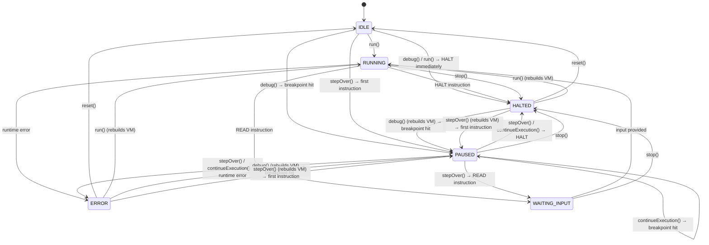

# AsciiAsm Debugger — Specification

**Version:** 0.1.0  
**Purpose:** Defines the debugger architecture, state machine, user actions, and UI integration for the AsciiAsm educational assembler.

---

## 1. Overview

The AsciiAsm debugger wraps the Virtual Machine (VM) with breakpoint management and step-by-step execution control. It follows a finite-state-machine (FSM) model where the current **VMState** determines which user actions are available.

### 1.1 Architecture Layers

| Layer | Module | Responsibility |
|-------|--------|----------------|
| **Core** | `Debugger` (`core/debugger.ts`) | Breakpoint storage, execution control (`step`, `continue`, `start`, `stop`, `reset`), state inspection |
| **Core** | `VM` (`core/vm.ts`) | Instruction execution, state transitions, I/O delegation |
| **Store** | `useAppStore` (`composables/useAppStore.ts`) | Reactive state, action guards (`canRun`, `canStep`, …), VM lifecycle (build / destroy) |
| **UI** | `App.vue` | Toolbar buttons, hotkey dispatch, visual feedback |
| **Editor** | `editor-setup.ts` | Breakpoint gutter, active debug line highlight |

---

## 2. VM States

The VM operates in one of six mutually exclusive states:

| State | Description |
|-------|-------------|
| `IDLE` | Initial state. No program is loaded or execution has been fully reset. All VM internal state is clean. |
| `RUNNING` | The VM is actively executing instructions. The UI is non-interactive (buttons disabled) except **Stop** and **Reset**. |
| `PAUSED` | Execution is suspended at a breakpoint or after a single-step. The user can inspect registers, memory, flags, and stdout. The editor highlights the current source line. |
| `WAITING_INPUT` | The VM has executed a `READ` instruction and is waiting for user input via a browser prompt. Transitions back to `RUNNING` once input is provided. |
| `HALTED` | The program has terminated normally (via `HALT` instruction) or was forcibly stopped by the user. |
| `ERROR` | A runtime error occurred (type mismatch, out-of-bounds memory access, execution limit exceeded, missing `HALT`, overflow in `halt` mode, etc.). The error message is stored and displayed. |

---

## 3. State Machine Diagram



---

## 4. User Actions

### 4.1 Action Definitions

| Action | Hotkey | Description |
|--------|--------|-------------|
| **Run** | `Ctrl+F5` | Build a fresh VM and run the program to completion without debug pausing. Output is produced at once. No breakpoints are checked. |
| **Debug** | `F5` | Build a fresh VM, sync breakpoints, and run until the first breakpoint or `HALT`. If a breakpoint is hit, transitions to `PAUSED`. |
| **Step Over** | `F10` | Execute exactly one instruction. If the VM is `IDLE`, implicitly builds a new VM first. After execution the VM is in `PAUSED` state (unless `HALT` or error). |
| **Continue** | `F5` | Resume execution from `PAUSED`. Runs until the next breakpoint, `HALT`, or error. Only available when `PAUSED`. |
| **Stop** | `⇧F5` | Forcibly abort execution. Sets VM state to `HALTED`. Available during `RUNNING`, `PAUSED`, and `WAITING_INPUT`. |
| **Reset** | `⌃⇧F5` | Destroy the VM and debugger instances. Clear all reactive state (registers, memory, flags, stdout, errors, debug line highlight). Return to `IDLE`. Always available. |

### 4.2 Action Availability Matrix

| Action | `IDLE` | `RUNNING` | `PAUSED` | `WAITING_INPUT` | `HALTED` | `ERROR` |
|--------|:------:|:---------:|:--------:|:----------------:|:--------:|:-------:|
| **Run** | ✓ | — | — | — | ✓ | ✓ |
| **Debug** | ✓ | — | — | — | ✓ | ✓ |
| **Step Over** | ✓ | — | ✓ | — | — | — |
| **Continue** | — | — | ✓ | — | — | — |
| **Stop** | — | ✓ | ✓ | ✓ | — | — |
| **Reset** | ✓ | ✓ | ✓ | ✓ | ✓ | ✓ |
| **Toggle Breakpoint** | ✓ | ✓ | ✓ | ✓ | ✓ | ✓ |

### 4.3 Action Guard Definitions

```
canRun      = state ∈ { IDLE, HALTED, ERROR }
canDebug    = state ∈ { IDLE, HALTED, ERROR }
canStep     = state ∈ { IDLE, PAUSED }
canContinue = state ∈ { PAUSED }
canStop     = state ∈ { RUNNING, PAUSED, WAITING_INPUT }
reset       — always available (no guard)
```

### 4.4 F5 Context-Sensitivity

The `F5` hotkey is context-sensitive:

```
F5 pressed →
  if canContinue (state = PAUSED)  → continueExecution()
  else if canDebug (state ∈ { IDLE, HALTED, ERROR }) → debug()
  else → no-op
```

This mirrors the familiar VS Code "start or continue" paradigm.

---

## 5. Action Sequences (Detailed)

### 5.1 `run()` — Full Execution

1. Clear `runtimeError` and `stdout`.
2. Call `buildVM()` → parse source, create VM and Debugger instances, sync breakpoints.
3. If parse errors exist → abort (remain in current state).
4. Set `vm.state = RUNNING`.
5. Call `vm.run()` (no breakpoint callback — runs without pausing).
6. On completion: VM is in `HALTED` or `ERROR`.
7. If `StepResult.error` exists → store it in `runtimeError`.
8. Sync all reactive state from VM → UI updates.

### 5.2 `debug()` — Debug Session Start

1. Clear `runtimeError` and `stdout`.
2. Call `buildVM()` → parse source, create VM and Debugger instances.
3. If parse errors exist → abort.
4. Clear debugger breakpoints, then re-sync from the UI breakpoint set.
5. Call `dbg.start()` → internally calls `vm.run(shouldPause)`.
6. VM runs until:
   - A breakpoint line is reached (after at least 1 step) → `PAUSED`
   - `HALT` instruction → `HALTED`
   - Runtime error → `ERROR`
   - Execution limit (1,000,000 steps) → `ERROR`
7. Sync state → editor highlights the paused line (if `PAUSED`).

### 5.3 `stepOver()` — Single Step

1. If no debugger instance exists (state = `IDLE` or after reset):
   - Call `buildVM()`. If parse errors → abort.
   - Clear `runtimeError` and `stdout`.
2. Call `dbg.stepOver()` → internally calls `vm.step()`.
3. VM executes exactly one instruction:
   - Normal instruction → state becomes `RUNNING` (then returns), store treats as `PAUSED`-equivalent since control returns.
   - `HALT` → `HALTED`
   - Error → `ERROR`
   - `READ` → `WAITING_INPUT` (browser prompt appears)
4. Sync state → editor highlights the next line to execute.

### 5.4 `continueExecution()` — Resume from Breakpoint

1. Requires `dbg` to exist (only available when `PAUSED`).
2. Call `dbg.continue()` → internally calls `vm.run(shouldPause)`.
3. VM runs until next breakpoint, `HALT`, or error (same as `debug()` but without rebuilding).
4. Sync state.

### 5.5 `stop()` — Abort Execution

1. Requires `dbg` to exist.
2. Call `dbg.stop()` → sets `vm.state = HALTED`.
3. Sync state → editor debug line highlight remains at last position.

### 5.6 `reset()` — Full Teardown

1. If `dbg` exists, call `dbg.reset()` (resets VM internals).
2. Clear all reactive state:
   - `stdout` → `''`
   - `runtimeError` → `null`
   - `vmState` → `IDLE`
   - `currentLine` → `null`
   - `registers` → `{ AX: null, BX: null, CX: null, DX: null }`
   - `flags` → `{ ZF: false, SF: false, OF: false }`
   - `memory` → `[]`
   - `memorySize` → `0`
3. Clear editor debug line highlight (`setDebugLine(null)`).
4. Destroy VM and Debugger references (`vm = null`, `dbg = null`).
5. State is now `IDLE` — ready for a new session.

---

## 6. Breakpoint Management

### 6.1 Breakpoint Storage

Breakpoints are stored in two synchronized locations:

| Location | Type | Purpose |
|----------|------|---------|
| `useAppStore.breakpoints` | `reactive(Set<number>)` | UI-side reactive set; persists across VM rebuilds |
| `Debugger.breakpoints` | `Set<number>` | Core-side set; used during execution to check pause conditions |

### 6.2 Synchronization

- **UI → Core**: On `buildVM()` and `debug()`, the store iterates over `breakpoints` and calls `dbg.addBreakpoint(line)` for each.
- **User toggle**: Clicking the editor gutter calls `onBreakpointToggle(line)`, which adds/removes the line from the store's `breakpoints` set. The editor's `breakpointState` (CodeMirror `StateField`) manages the visual marker independently.
- Breakpoints are **1-based source line numbers**.

### 6.3 Breakpoint Behavior During Execution

When `vm.run(shouldPause)` is called:
- Before each instruction, the VM checks `shouldPause(currentLine)`.
- The check is **skipped on step 0** (the first instruction after `start()`/`continue()`) to avoid re-pausing on the same line.
- If `shouldPause` returns `true` on step > 0 → VM sets state to `PAUSED` and returns immediately.

### 6.4 Toggle Availability

Breakpoints can be toggled at **any time**, regardless of VM state. However, breakpoints toggled during an active debug session are **not synced** to the core Debugger until the next `buildVM()` or `debug()` call.

---

## 7. State Inspection (Debug Panel)

When the VM is in `PAUSED` state, the following data is available for inspection:

| Data | Source | Description |
|------|--------|-------------|
| **Current Line** | `vm.currentLine` | 1-based source line of the next instruction to execute |
| **Registers** | `vm.registers.getSnapshot()` | Values and types of AX, BX, CX, DX |
| **Flags** | `vm.registers.getFlagsSnapshot()` | ZF, SF, OF boolean values |
| **Memory** | `vm.memory.getSnapshot()` | Full memory array (ASCII codes) |
| **Stdout** | `vm.stdout` | Accumulated program output |
| **Breakpoints** | `Debugger.getBreakpoints()` | Set of active breakpoint lines |

State is synced to reactive Vue refs via `updateStateFromVM()` after every action.

---

## 8. Editor Integration

### 8.1 Debug Line Highlight

- The editor uses a CodeMirror `StateField` (`activeDebugLineState`) to track the currently paused line.
- `setDebugLine(view, lineNumber)` dispatches an effect to update the field.
- A `Decoration.line` with class `cm-debug-active-line` highlights the line (yellow tint background).
- A gutter marker (`▶`) appears in the debug gutter beside the active line.
- When `lineNumber` is `null`, all debug decorations are cleared.

### 8.2 Breakpoint Gutter

- A dedicated gutter column (`cm-breakpoint-gutter`) is displayed to the left of line numbers.
- Clicking a gutter element toggles a red dot (`●`) marker on that line.
- The gutter fires an `onBreakpointToggle(lineNumber)` callback to sync with the store.

### 8.3 Editor Read-Only During Debug

The editor is **not** set to read-only during debugging. Source changes during an active debug session will cause the store's `onChange` callback to re-parse, but the running VM/Debugger continues with the originally compiled program. A `reset()` is required to pick up source changes.

---

## 9. VM Build Pipeline

The `buildVM()` function is called by `run()`, `debug()`, and `stepOver()` (on first step). It always creates a **fresh** VM:

```
buildVM():
  1. parseSource()
     └─ Lexer.tokenize() → tokens
     └─ Parser.tryParse() → { program, errors }
     └─ if errors → return false
  2. Create VMIO { requestInput, writeOutput }
  3. vm = new VM(program, io)
  4. dbg = new Debugger(vm)
  5. Sync breakpoints: store.breakpoints → dbg.addBreakpoint(line)
  6. updateStateFromVM()
  7. return true
```

### 9.1 VM Constructor Initialization

- Allocate `Memory` with size and optional init value from `#memory` directive.
- Apply all `#data` directives to memory.
- Initialize `RegisterFile` (all registers null/unset).
- Set instruction pointer to `_start` label index (or 0 if absent).
- State = `IDLE`.

---

## 10. Error Handling

### 10.1 Parse Errors

- Detected during `parseSource()` in `buildVM()`.
- If any parse errors exist, `buildVM()` returns `false` and no VM is created.
- Parse errors are displayed in the UI via `parseErrors` reactive ref.
- The editor linter (`asciiasm-linter.ts`) also shows inline diagnostics.

### 10.2 Runtime Errors

- Caught during `vm.step()` execution.
- The VM transitions to `ERROR` state.
- The error message is returned in `StepResult.error` and stored in `runtimeError`.
- Common errors:
  - `Runtime Error: Type Mismatch` — cross-type operation
  - `Runtime Error: Type Overflow` — overflow in `#on_overflow halt` mode
  - `Runtime Error: Memory access out of bounds`
  - `Unexpected end of program (missing HALT)`
  - `Execution limit exceeded (infinite loop?)`

### 10.3 Safety Limit

The VM enforces a maximum of **1,000,000** steps per `run()` call. Exceeding this limit produces an `ERROR` with the message "Execution limit exceeded (infinite loop?)".

---

## 11. Hotkey Map

| Hotkey | Action | Guard |
|--------|--------|-------|
| `Ctrl+F5` | `run()` | `canRun` |
| `F5` | `debug()` / `continueExecution()` | Context-sensitive (see §4.4) |
| `F10` | `stepOver()` | `canStep` |
| `⇧F5` | `stop()` | `canStop` |
| `⌃⇧F5` | `reset()` | Always |

### 11.1 Hotkey Priority

Hotkeys are matched in this order to resolve overlapping key combinations:

1. `⌃⇧F5` (reset) — checked first (most specific modifier combo)
2. `⇧F5` (stop)
3. `Ctrl+F5` (run)
4. `F10` (step)
5. `F5` (debug/continue) — checked last (least specific)

---

## 12. Toolbar UI

The toolbar displays six action buttons in this order:

```
[ Run Ctrl+F5 ] [ Debug F5 ] | [ Step F10 ] [ Continue F5 ] | [ Stop ⇧F5 ] [ Reset ⌃⇧F5 ]  STATE
```

- Disabled buttons have `opacity: 0.4` and `cursor: not-allowed`.
- Each button group is separated by a visual `|` divider.
- The current `VMState` is displayed as a status badge on the right.
- Button colors:
  - **Run** / **Continue**: green (`#4ec9b0`)
  - **Debug**: yellow (`#dcdcaa`)
  - **Step**: blue (`#9cdcfe`)
  - **Stop**: red (`#f44747`)
  - **Reset**: gray (`#808080`)
